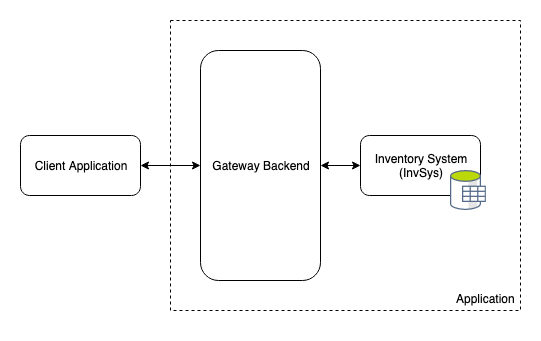
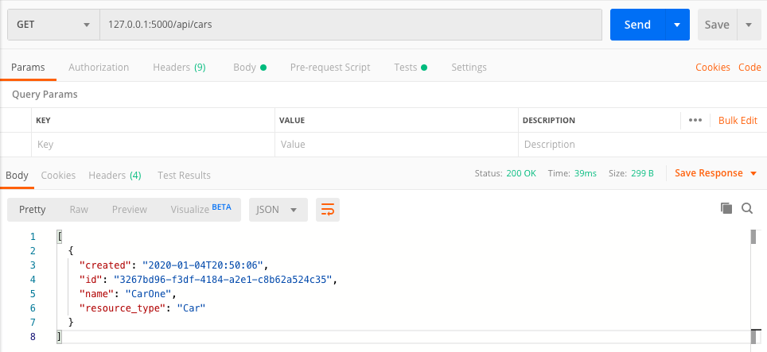
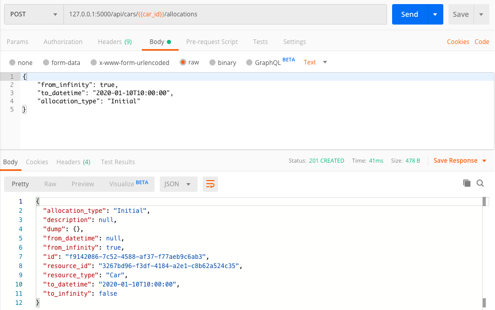

# Creating a multi-microservice application deployed using docker-compose

Typically I skip any guide that requires me to make external accounts or has any propriety dependencies, so this guide doesn’t require any of that, and the end result will be deployed on local, so no need to worry about making trial accounts with cloud hosts.

This guide will consider the development of a system comprised of multiple intercommunicating micro-services. The stack of this application is one of personal preference, but there are any number of different variations, so check out the stack below before we go into further detail.

### Stack used in this guide:
- Flask backends
- SQLite3 with flask SQL Alchemy
- Docker
- Docker-compose
- Postman

### Prerequisites:
- A python environment handler, because we will create multiple environments. I use conda, but you could also using something like venv or poetry.
- You need to have docker installed (add link), this guide won’t cover that process because the docker documentation is very complete.
- Some knowledge of Flask apps, SQL ORMs, and Docker. In a lot of cases I will go through examples assuming some prior knowledge, but in those cases I will link to external resources that cover them in more detail if relevant.

### Terminology:

Having started writing this, I realised that I quickly start using terms which may mean different things to different people, so I will clarify terminology before we continue.

- Client: The end-user who consumes the UI in their browser
- API Client: Anything which consumes an API (internal or external)
- Backend: A backend is any system which exposes an API to be consumed. It could be a simple Flask app, or an express app, or any many other things which aren’t necessarily HTTP servers.
- Application: An application is a collection of backends which work together.
- Frontend: A system which handles the direct client interactions, so this covers the UI of the webpage, which could either be presented as a SPA (single page application) or as an express app which renders html server-side.
- Component: Backends and Frontends can both be considered as Components. Components are standalone and should be tested/testable by themselves.

## When would we need to make an application like this?

What we intend to make is a backend application consisting of multiple micro-services. Typically one can find guides showing someone how to make any individual section of this guide, and typically they would use a different stack including more javascript based backends, or using databases like firestore, dynamo, or redis (which can be used as a database).

## Context

Recently I was working on a large multi component application built with many flask micro services and found difficulties throughout where even in-depth google searches couldn’t guide me to the correct answer. At the time I wasn’t considering writing a guide about it, so I didn’t make note of most of these issues, but this guide will hopefully cover all the things I wish I could have found more easily.

## What will we make?

We want to develop a backend application comprised of multiple micro-services. The backend will handle database interactions and any external API integrations.

For the purpose of this guide, we will make a simple inventory management system. Really this could be done with just a frontend and a single backend component, but we will add some additional steps to give wider coverage. I have chosen this project as it was something that developed out of the larger project I was working on and thought it would work well exposition-ally.

The additional step will be an API gateway backend which is a sort of router and authoriser of the client requests. This means our ‘application’ will consist of two backend components, one being the inventory manager, and one being the api gateway, and there will also be a frontend component. The application will expose a RESTful interface (we will get to this) which is to be consumed by the frontend

### What is the scope of the inventory management system?
In this system we consider that have resources which relate the physical items. The resources should be able to be allocated for arbitrary durations. In this case, we will only consider one type of resource, continuous resources.

Continuous resources are items that can be allocated for any duration, starting at any time, and ending at any time. An example of this could be a bookable self-driving car. It is a continuous resource because when it is booked for a journey, it be for any duration.

<p align="center"></p>

The alternative is an interval resource, which would be something like a launchpad or a runway, which may have discrete defined intervals for when they can be booked. Note that in any case, there can’t be any overlap of the allocations made on a resource.

<p align="center"></p>

The scope of our system is for handling the booking of three different type of continuous resource, the self-driving car, lorry, and truck.

We want to be able to register a new instance of each to represent when one has been added into circulation, and we want to be able to delete them to represent when they have been decommissioned. We then want to be able to allocate and deallocate any of them.

## System definition?
Before starting, we should define our system to some extent and define how we expect the user to be able interact with it. We do this using UML diagrams and sequence diagrams respectively.

### UML:

We can describe our system with the following diagram. It allows us to clearly visualise each component and the respective links between our components. The UML doesn't state anything about the content of the interfaces.

<p align="center"></p>

### Basic sequence diagram:

We can describe how the API client interacts with our system using the sequence diagram below. Note that any internal complexities are hidden, all we care about it how the API client interacts with the application

…

### Advanced sequence diagram:

From an internal development perspective it can be useful to see more information that doesn’t need to be exposed to the API client, we can do that with the following diagram

…

### Swagger:

We can define the interface of our application by creating a swagger definition. A swagger definition is a file or collection of files which define the endpoints, methods, content, and responses that can be expected by interacting with our application. Swagger definitions are then use by API client while they develop the integration between their component and the application. Swagger can also be used for validation of request content and even for auto-generation of code.

Our system is a basic CRUD (create, read, update, delete) app with some additional validations, so our applications swagger should be quite simple (Maybe I'll add this later).

## Development:

We will start by developing the backend and we start with the central system, which is the inventory management application, and then work outwards. If you work is an agile team, you will know this is the wrong approach. What we are doing here is called ‘horizontal slicing’, when what you would do in an agile is ‘vertical slicing’.

> Horizontal slicing is the practice of splitting development into technical layers. Such as splitting a project by frontend, backend, database layer. Horizontal slicing requires all slices to be completed before the client can use the software.

> Vertical slicing is the practice of spltting by functionality. In practise this means small parts of each technical layer will be developed together, allowing functionality to be available sooner, at the sacrifice of having incomplete technical layers.

So while I acknowledge that this isn’t the optimum approach, it is a much easier way to handle development from a technical perspective.

So the development will goes a follows:

Inventory management flask app -> API gateway application -> Combined deployment

## Inventory Management App (InvSys):

Start by creating a new directory in our project directory, we will call it `invsys`, short for inventory system. `cd` into this directory, because all development in this section will be done in `invsys`. You should create a new python environment for this component so it can be self contained with its own dependencies tracked.

This application is a Flask app which exposes an API for creating the resources (car, truck, lorry) and creating allocations for the instances.

So we create a file called `application.py` which we will use to create a function that will create our application. Why a function to create the app instead of just instantiating the app at module level? Well if we want a dynamic configuration, such as to create a test app or a production app, then it is helpful to be able to pass parameters or configs while creating the app. If we define the app at module level, without a function to create it, it is harder to handle dynamic configurations.

A dummy flask app could look like the following:
```python
# application.py

from flask import Flask, Response

def create_application() -> Flask:
    app = Flask(__name__)

    app.route("/")
    def dummy():
        return Response("This is InvSys")

    return app

if __name__==“__main__”:
    app = create_application()
    app.run(host=“127.0.0.1”, port=5000, debug=True)
```

Before running this, you’ll notice that we import the flask module, so in your new python environment for `invsys`, running `pip install flask`, else you will get an ImportError like `“ImportError: No module named flask”`

If you run this using `python application.py`, you should now be able to put `127.0.0.1:5000` in your browser and see `This is InvSys`.

By installing flask we have added a dependency to this component, and as it should be self contained and reproducible with a consistent dependency, we should track this dependancy. We will do this by making a `requirements.txt` file which will list each dependancy and their version. While this can be made manually, we will cheat by running the command `pip freeze > requirements.txt`, which will list all the dependencies (in your hopefully clean python environment) and put them into the requirements.txt file.

```
# requirements.txt

Flask==1.1.1
```

This dummy application by itself isn't very useful, so before we start developing the actual application, lets define it. We know that the purpose is have resources that can be allocated, with 3 different types of resources. For each resource type, we want the following endpoints (we're being RESTful to an extent):

- POST /{resource_type} - to create an instance of the resource
- GET /{resource_type} - to get all instances of a given resource type
- GET /{resource_type}/<resource_id> - get a specific instance
- DELETE /{resource_type}/<resource_id> - delete a specific instance of a resource
- POST /{resource_type}/<resource_id>/allocations - create an allocation for this resource instance
- GET /{resource_type}/<resource_id>/allocations - get all allocations for this resource instance
- GET /{resource_type}/<resource_id>/allocations/<allocation_id> - get a specific allocation
- DELETE /{resource_type}/<resource_id>/allocations/<allocation_id> - delete the allocation

Note: the resource_type is static, there are only 3 of them and there is no way to add more of them using this interface, while the resource_ids and allocation_ids are dynamic and can be created using this interface.

Now we could go ahead and add a url rule for each of these to to application like such:

```python
from flask import Flask, jsonify

def create_application() -> Flask:
    app = Flask(__name__)

    app.route("/<resource_type>", methods=['POST'])
    def create_resource_instance(resource_type):
    # Here we will create the resource instance
        return jsonify({}), 201

    # Continue making routes for all the other endpoint/method combinations
    ...

    return app
```

If we were to do this though, our `applications.py` file would become very large very quickly. Additionally, we'd then need some way to distinguish the flows for creating interval resources and continuous resources (if interval resources were to be added at some point). Instead we could make the application more modular by using Flask Blueprints. Blueprints allow us to better organise and split our application.

While there may be other ways, I would think the best way to split the blueprints would be one for interval resources, and one for continuous resources. So in this case we will only have one blueprint, just for the continuous resources, but it allows us to make the code more flexible for future development. This reason alone isn't enough for using the Blueprint, because in development you often hear that making code future proof can be a waste of time, so there is another reason we will get to.

So inside our `invsys` directory we will make a `blueprints` directory with an `__init__.py`, and make a file called `continuous_resource_blueprint.py`.

At this point your overall project directory should resemble this:

```
.
└── invsys
    ├── application.py
    ├── requirements.txt
    └── blueprints
        ├── __init__.py
        └── continuous_resource_blueprint.py
```

I will mention two ways of handling the Blueprint with regard to the 3 resource types.

First, we could just create a static Blueprint which has the resource type as a dynamic element in the url, then each route function will need to validate the resource type (perhaps using a decorator), it could look something like this:

```python
# blueprints/continuous_resource_blueprint.py

from flask import Blueprint, jsonify

blueprint = Blueprint('ContinuousResourceBlueprint', __name__)

@blueprint.route('/<resource_type>', methods=['POST'])
def create_continuous_resource(resource_type):
    # Create the resource somehow
    return jsonify({}), 201

# Do the same for all the other endpoints
...
```
And then in our application.py we would register the Blueprint like so:
```python
# application.py

from flask import Flask, jsonify
from blueprints.continuous_resource_blueprint import blueprint as continuous_resource_blueprint

def create_application() -> Flask:
    app = Flask(__name__)
    app.register_blueprint(continuous_resource_blueprint)
    return app
```
While this would work just fine, you'd need to somewhere define acceptable resource_types, either in the environment for flexibility, or in some config.

If we know that the resource types are unlikely to change, then it would be nice for them to be clearly stated in the `application.py`. One way to do that would be using creating Blueprints using a function which states the resource type using closures.

Before looking at the blueprint, if we look at the new `applications.py` file, it would look more like this:

```python
from flask import Flask
from blueprints.continuous_resource_blueprint import create_continuous_resource_blueprint

def create_app() -> Flask:
    app = Flask(__name__)

    # Register continuous resource blueprints
    app.register_blueprint(
        create_continuous_resource_blueprint(
            blueprint_name="CarsBlueprint", # The name, used by flask when using the url_for function
            resource_type="Car", # The resource type
            resource_prefix="cars" # The base of the url for this resource type
        ),
        url_prefix='/api'
    )

    # Then do the same for lorry and truck
    ...

    return app
```
The benefit of the above snippet is that by looking at my `application.py` one can clearly see that the application has a continuous resource of type `Car` with the base url of `/cars`.

Note in the above snippet, I've added the `url_prefix` to the registered blueprint. This means to access any of our urls in the blueprint, we need to put `/api` first like, `/api/cars/resources`. I do this to allow my backends to expose simple UIs using endpoints that don't have the `/api` prefix. For example I might route `/` to return a simple UI showing our inventory in this application, but we won't cover that. In other applications you might see prefixes like `/api/v1` and then they will create a new blueprint with the prefix `/api/v2` if they change the functionality of the service or are forced to add some backwards incompatible change.

In our `continuous_resource_blueprint.py` we would then implement something like this:
```python
from flask import Blueprint

def create_continuous_resource_blueprint(blueprint_name: str, resource_type: str, resource_prefix: str) -> Blueprint:
    """
    blueprint_name: name of the blueprint, used by Flask for routing
    resource_type: name of the specific type of interval resource, such as Car or Lorry
    resource_prefix: the plural resource to be used in the api endpoint, such as cars, resulting in "/cars"
    """
    blueprint = Blueprint(blueprint_name, __name__)

    @blueprint.route(f'/{resource_prefix}', methods=["POST"])
    def create_resource():
        return jsonify({}), 201

    @blueprint.route(f'/{resource_prefix}', methods=["GET"])
    def get_resources():
        return jsonify({}), 201

    # We then do this for all the other endpoints we listed
    ...

    return blueprint
```

So we have the general setup of the Flask app and the blueprints for handling our three continuous resources. You'll note that the above snippet isn't using the resource_type parameter for anything, and this is because we have been neglecting an essential part of this component.

### How and where do we store the resources and allocations?
Well, I said in the introduction that we were going to use SQLAlchemy, so that was a spoiler. We will store the allocations and resources in an SQLite3 database and use SQLAlchemy as an ORM for accessing the database. More specifically we will use flask-SQLAlchemy which you can install using `pip install flask-SQLAlchemy`, remember, you will need to update your requirements.txt file with this new dependancy.

As is typical in this guide, I will show you two ways to handle the database related logic, with the latter being my preferred approach in this scenario, but we will get to this shortly as there is some setup and common work that needs to be done first.

Firstly, how do we actually use and initialise the database?

In single file flask applications, you will typically see something like this in guides:
```python
# application.py

from flask import Flask
from flask_sqlalchemy import SQLAlchemy

app = Flask(__name__)
app.config['SQLALCHEMY_DATABASE_URI'] = "sqlite:///mydatabase.db"
db = SQLAlchemy(app)

# Create the models (we'll get to this after)
with app.app_context():
    db.create_all()

# Then afterwards we register routes or blueprints that we have imported
...
```
But in doing this we create a problem. Our routes/models/blueprints are in other files, and they might need access to the database to make objects and commit changes. So in this file you will be importing those modules, and in those modules you would need to import the database from this file, which creates a circular import problem.

To avoid this circular import problem, we just put the database in a separate file. In the same directory as your `application.py`, create a new file called `database.py` which should look like this:
```python
# database.py

from flask_sqlalchemy import SQLAlchemy

db = SQLAlchemy()
```
Then from our 'application.py' and our routes and blueprints, we can import the db object from this module with no circular dependancy issues.

So our 'application.py' could now look like this instead:
```python
from flask import Flask
from database import db

def create_app(db_uri: str) -> Flask:
    app = Flask(__name__)
    app.config['SQLALCHEMY_DATABASE_URI'] = db_uri
    # We still need to initialise the db with the flask app, but we can do this after the object has been initialised by using init_app
    db.init_app(app)

    with app.app_context():
        db.create_all()

    # Here we would then register our blueprints or routes
    ...

    return app
```
The common aspect will be the models. These are our classes which represent the tables, and the subsequent, and relationships in the database.

Because we are being generic, we only need two tables. One to represent a continuous resource, and one to represent a continuous resource allocation.

In the `invsys` directory create a subdirectory called `models` with an `__init__.py` and then inside our `models` directory we will create two new files, `continuous_resource.py` and `continuous_resource_allocation.py`.

Your invsys directory should now look like this:

```
.
├── application.py
├── requirements.txt
├── database.py
├── blueprints
│   ├── __init__.py
│   └── continuous_resource_blueprint.py
└── models
    ├── __init__.py
    ├── continuous_resource.py
    └── continuous_resource_allocation.py
```

Lets look at the "continuous_resource.py" first. The ContinuousResource model represents a car/lorry/truck, so each we need a column for the resource type, the resource name (a specific unique identifier which is human readable) and a uuid (also unique, but just a 36 digit uuid, which is somewhat a duplication in purpose as the name column, but the uuid will be used when working with the endpoints). We will add a 'created' datetime column too.

From a ContinuousResource, it will be useful to be able to access all the allocation related to this resource, so we create an 'allocations' relationship.

```python
# continuous_resource.py

from database import db
import datetime

class ContinuousResource(db.Model):
    __tablename__ = "continous_resources" # Specified instead of using the default

    id = db.Column(db.String(36), primary_key=True, unique=True)
    name = db.Column(db.String(36), primary_key=True, unique=True) # Eg Car1
    resource_type = db.Column(db.String(36), primary_key=True) # Car/Lorry/Truck
    created = db.Column(db.DateTime, nullable=False, default=datetime.datetime.utcnow)

    # Children
    allocations = db.relationship("ContinuousResourceAllocation", back_populates="resource", lazy=True)
```

Now we look at the 'continuous_resource_allocation.py'. We can define a ContinuousResourceAllocation as an object with a from_datetime, and a to_datetime. Then in some cases, the allocation might want to be considered as from infinity or to infinity, so we will add a boolean column for those two options, and make all four of these columns nullable. Therefore you could create an allocation from now until infinity to indicate an indefinite maintenance period for this resource making it unallocatable. Again we can add the resource type, an id, and some additional columns like a description, or an allocation type (like a "booking", or "maintenance"). Finally, we will add a json dump column for storing any additional data about the allocation, and we can add a property method to return the dictionary representation, called 'dump'.

To finalise the relationship between the two models, we pass the resource_id of the related ContinuousResource as a ForeignKey column, and then make the 'resource' relationship.

```python
# continuous_resource_allocation.py

from database import db
import datetime

class ContinuousResourceAllocation(db.Model):
    __tablename__ = "continuous_resource_allocations"

    id = db.Column(db.String(36), primary_key=True, unique=True)
    resource_type = db.Column(db.String(36), primary_key=True)
    created = db.Column(db.DateTime, nullable=False, default=datetime.datetime.utcnow)
    from_infinity = db.Column(db.Boolean, default=False)
    to_infinity = db.Column(db.Boolean, default=False)
    from_datetime = db.Column(db.DateTime, nullable=True)
    to_datetime = db.Column(db.DateTime, nullable=True)
    allocation_type = db.Column(db.String(20))
    description = db.Column(db.String(100), nullable=True)
    json_dump = db.Column(db.String(200), nullable=True)

    # Parents
    resource_id = db.Column(db.ForeignKey('continuous_resources.id'))
    resource = db.relationship('ContinuousResource', foreign_keys=resource_id)

    @property
    def dump(self) -> dict:
        try:
            return json.loads(self.json_dump)
        except:
            return {}
```

### We have our models, now what?
Well our blueprint doesn't actually do anything yet, it just defines our endpoints and methods, so we have to tell each of our endpoint route functions what to do with the database. Now before, I mentioned there were two ways of doing this.

Lets look at the first way where in our blueprint, we consume the models and database directly.

Our 'continuous_resource_blueprint.py' could start to look like this (Note: we aren't returning anything yet from our endpoint functions, we'll get to that):

```python
from flask import Blueprint
from database import db
from models.continuous_resource import ContinuousResource
import uuid

def create_continuous_resource_blueprint(blueprint_name: str, resource_type: str, resource_prefix: str) -> Blueprint:
    """
    blueprint_name: name of the blueprint, used by Flask for routing
    resource_type: name of the specific type of interval resource, such as Car or Lorry
    resource_prefix: the plural resource to be used in the api endpoint, such as cars, resulting in "/cars"
    """
    blueprint = Blueprint(blueprint_name, __name__)

    @blueprint.route(f'/{resource_prefix}', methods=["POST"])
    def create_resource():
        new_resource = ContinuousResource(id=str(uuid.uuid4()), **request.get_json()) # We assume request has everything we need in it for now
        db.session.add(new_resource)
        db.session.commit()
        return jsonify({}), 201

    @blueprint.route(f'/{resource_prefix}', methods=["GET"])
    def get_resources():
        resources = ContinuousResource.query.filter_by(resource_type=resource_type)
        return jsonify({}), 201

    # We then do this for all the other endpoints we listed
    ...

    return blueprint
```
If you look at the above snippet, you will see that we mention the database and models directly. For some applications this is fine, but imagine that we later decide to change what sort of database we are using. Or we change our ORM. This means all our database references in our blueprints and routes will need updating. This means our blueprints are 'coupled' with our databasing.

The second approach attempts to decouple the blueprints from the by using a concept know as DAOs (data access objects) or DALs (data access layers).

We will create a DAO which will be used to handle any related databasing for continous resources (including allocations). The DAO will encapsulate the database logic. Therefore if we want to migrate database, we just need to update the DAO and nothing that consumes the DAO will need to be touched.

In invsys we will create a new directory called 'daos' with an __init__.py, then a dao file 'continuous_resource_dao.py'.

Our directory now looks like this:

```
.
├── application.py
├── requirements.txt
├── database.py
├── blueprints
│   ├── __init__.py
│   └── continuous_resource_blueprint.py
├── daos
│   ├── __init__.py
│   └── continuous_resource_dao.py
└── models
    ├── __init__.py
    ├── continuous_resource.py
    └── continuous_resource_allocation.py
```
Our DAO is just a class containing static methods for each database related query

```python
# continuous_resource_dao.py

from database import db
from typing import List
from models.continuous_resource import ContinuousResource
import uuid

class ContinuousResourceDao:
    @staticmethod
    def create_resource(resource_type, name) -> ContinuousResource:
        resource = ContinuousResource(
            id=str(uuid.uuid4()),
            resource_type=resource_type,
            name=name
        )
        db.session.add(resource)
        db.session.commit()
        return resource

    @staticmethod
    def get_resources(resource_type) -> List[ContinuousResource]:
        return ContinuousResource.query.filter_by(resource_type=resource_type)

    # There will be more functions for each other query
    ...
```
And then in our blueprint, we use the DAO instead of the direct database accesses

```python
# continuous_resource_blueprint.py

from flask import Blueprint, request, jsonify
from daos.continuous_resource_dao import ContinuousResourceDao

def create_continuous_resource_blueprint(blueprint_name: str, resource_type: str, resource_prefix: str) -> Blueprint:
    """
    blueprint_name: name of the blueprint, used by Flask for routing
    resource_type: name of the specific type of interval resource, such as Car
    resource_prefix: the plural resource to be used in the api endpoint, such as cars, resulting in "/cars"
    """
    blueprint = Blueprint(blueprint_name, __name__)

    @blueprint.route(f'/{resource_prefix}', methods=["POST"])
    def create_resource():
        resource = ContinuousResourceDao.create_resource(
            resource_type=resource_type,
            name=request.get_json(force=True)['name']
        )
        return jsonify({}), 201

    @blueprint.route(f'/{resource_prefix}', methods=["GET"])
    def get_resources():
        resources = ContinuousResourceDao.get_resources(resource_type=resource_type)
        return jsonify({}), 200

        # Then all the other endpoints
        ...

    return blueprint
```

Ok, so we have covered the blueprints, the routing of endpoints, the databasing and daos, but we still aren't actually returning anything. Each endpoint function should end up with a model object or list of model objects. If you create a resource, you will have a ContinuousResource instance, if you create an allocation, you will have ContinuousResourceAllocation instance, if you get all resources, you will have a list of ContinuousResources.

We can't directly return these objects in our API. Our API returns json. So instead we can create dictionary representations of these objects, and allow flask to return them as json using the jsonify function. So each object needs serialiser.

We can create a new directory called `serialisers` with an `__init__.py`, and we will create a serialiser for each model. So we create `continuous_resource_serialiser.py` and `continuous_resource_allocation_serialiser.py`.

Directory now looks like this:

```
.
├── application.py
├── requirements.txt
├── database.py
├── blueprints
│   ├── __init__.py
│   └── continuous_resource_blueprint.py
├── daos
│   ├── __init__.py
│   └── continuous_resource_dao.py
├── models
│   ├── __init__.py
│   ├── continuous_resource.py
│   └── continuous_resource_allocation.py
└── serialisers
    ├── __init__.py
    ├── continuous_resource_allocation_serialiser.py
    └── continuous_resource_serialiser.py
```

The serialiser takes an instance of the object and returns a dictionary with serialisable data types. So in our serialisers we need to convert datetimes into strings else we will encounter problems using jsonify.

```python
# continuous_resource_serialiser.py

class ContinuousResourceSerialiser:
    @staticmethod
    def serialise(resource) -> dict:
        return {
            'id': resource.id,
            'name': resource.name,
            'resource_type': resource.resource_type,
            'created': resource.created.strftime("%Y-%m-%dT%H:%M:%S")
        }
```

and:

```python
# continuous_resource_allocation_serialiser.py

class ContinuousResourceAllocationSerialiser:
    @staticmethod
    def serialise(allocation) -> dict:
        return {
            'id': allocation.id,
            'resource_type': allocation.resource_type,
            'resource_id': allocation.resource_id,
            'from_infinity': allocation.from_infinity,
            'to_infinity': allocation.to_infinity,
            'from_datetime': (
                allocation.from_datetime.strftime("%Y-%m-%dT%H:%M:%S")
                if allocation.from_datetime
                else None
            ),
            'to_datetime': (
                allocation.to_datetime.strftime("%Y-%m-%dT%H:%M:%S")
                if allocation.to_datetime
                else None
            ),
            'allocation_type': allocation.allocation_type,
            'description': allocation.description,
            'dump': allocation.dump
        }
```

Now in our blueprint we serialise our model instances before returning them.

```python
# continuous_resource_blueprint.py

from flask import Blueprint, request, jsonify
from daos.continuous_resource_dao import ContinuousResourceDao
from serialisers.continuous_resource_serialiser import ContinuousResourceSerialiser

def create_continuous_resource_blueprint(blueprint_name: str, resource_type: str, resource_prefix: str):
    """
    blueprint_name: name of the blueprint, used by Flask for routing
    resource_type: name of the specific type of interval resource, such as boy bay or payload bay
    resource_prefix: the plural resource to be used in the api endpoint, such as bot_bay, resulting in "/bot_bays"
    """
    blueprint = Blueprint(blueprint_name, __name__)

    @blueprint.route(f'/{resource_prefix}', methods=["POST"])
    def create_resource():
        resource = ContinuousResourceDao.create_resource(
            resource_type=resource_type,
            name=request.get_json(force=True)['name']
        )
        return ContinuousResourceSerialiser.serialise(resource), 201

    @blueprint.route(f'/{resource_prefix}', methods=["GET"])
    def get_resources():
        return jsonify([
            ContinuousResourceSerialiser.serialise(resource)
            for resource in ContinuousResourceDao.get_resources(resource_type=resource_type)
        ]), 200
```
Note that we use 201 as a status code if something has been created, and 200 in cases where the request is OK but nothing is created.

You'll need to fill in the blanks for all the other endpoints I've glossed other (look at the source code in the repo).

We will have a look together now at the function for creating a new allocation, because this function needs to validate that the allocation can be made.

...

If you run `python application.py` you should now be able to target the application to create resources and allocations with populated responses.

If I open Postman and POST a new car instance to `127.0.0.1:5000/api/cars`, you should get a response containing the request body and the new uuid.

<p align="center"></p>

We can retrieve the car using GET `127.0.0.1:5000/api/cars`

<p align="center"></p>

You can post an allocation:

<p align="center"></p>

This works just fine, but it assumes you have the python environment set up correctly. We can avoid this issue by running the application in a Docker container. What we need to do is create a Dockerfile, which will be used to create a docker image of our application, and then you can use docker to run the image in a container.

In the `invsys` directory create a file called `Dockerfile`. Our Dockerfile will look like this:
```
# Dockerfile

FROM python:3.7-alpine
COPY requirements.txt /
RUN pip install -r /requirements.txt
COPY . /app
WORKDIR /app
EXPOSE 5001
CMD [ "python", "application.py" ]
```
We use `FROM python:3.7-alpine` as our base as it has the correct python version, and the `alpine` images are relatively small compared to non-alpine images (a few megabyes as opposed to a few hundred megabytes). We `COPY requirements.txt /` which makes the file available in our docker image, and then install it using `RUN pip install -r /requirements.txt`. We then copy the rest of our source code into a subdirectory called `app` with `COPY . /app`. Using `WORKDIR /app` means the next commands will be executed in that directory. We `EXPOSE 5001` to expose port 5001, which is the port defined in our `application.py`. Then finally we state the command to run the application, which is `CMD [ "python", "application.py" ]`.

When you run an the application without docker, it will create a database in the invsys directory called `red.db`. Which means when you create your docker image, you will already have your database in your image with any existing data in it. So avoid this by adding a `.dockerignore` file to your directory, containing `red.db`. Now when you build your image, there will be a fresh image. For this project we aren't concerned about database persistence and volumes.

Now that we have a Dockerfile (and our .dockerignore), we can build the image using `docker build -t invsys .`, which will build an image called `invsys` based off of the Dockerfile in our current directory (`.`).

Then you can deploy your application using `docker run -p 5001:5001 invsys` and target it the same way as before using Postman. The `-p 5001:5001` is for routing the docker machine port to the port of our container.

## Gateway Application
### Why do we need one?
- The Gateway allows us to present a single public interface to access our microservices. From a technical perspective it means the API client only needs to target a single host and single port instead of communicating with multiple services running on different ports and hosts. So for one, it adds convenience.
- Another benefit is to orchestrate the authentication and authorisation of requests. Authentication is typically handled by an external system, but then the Gateway will communicate with that system to confirm requests are authorised before internally routing them to the correct microservices.
- The Gateway can also handle authorisation, which is determining whether requests have permissions to access certain resources. In many cases, like the invsys system we developed above, in our service we don't take into consideration which client is consuming the service. By making our services client-agnostic, we allow them to focus on their specific purpose which makes them more maintainable, more discrete, and more reusable. So our Gateway can then integrate middleware that determines which resources belong to which clients, which itself might done by integrating another microservice for handling client accounts and resources.

### What will ours do?
We want our gateway to just route requests to our invsys service. Nothing else will be integrated, but by doing this you will see how to consume one service from another service, and when you can do it for one, you can do it for many.

### Lets do it
Inside our main project directory, create a new directory called `gateway`. `cd` into this directory. We will create another Flask application here, though it will be much simpler. Create an `application.py` again, create another fresh python environment and install Flask again. Create a `requirements.txt` again. Your overall project directory structure should look like this:
```
.
├── gateway
│   ├── application.py
│   └── requirements.txt
└── invsys
    ├── Dockerfile
    ├── application.py
    ├── database.py
    ├── requirements.txt
    ├── blueprints
    │   ├── __init__.py
    │   └── continuous_resource_blueprint.py
    ├── daos
    │   ├── __init__.py
    │   └── continuous_resource_dao.py
    ├── models
    │   ├── __init__.py
    │   ├── continuous_resource.py
    │   └── continuous_resource_allocation.py
    └── serialisers
        ├── __init__.py
        ├── continuous_resource_allocation_serialiser.py
        └── continuous_resource_serialiser.py
```

So again, before developing the application, lets define it a bit further.

### Definition
For demonstration purposes, we will only handle two of the `invsys` endpoints for routing. So our application will accept requests to:

- POST /api/{resource_type}
- GET /api/{resource_type}

We expect our application to receive the request from the API client, forward the payload or query strings to `invsys`, then forward the response from `invsys` back to the API client.

... flow diagram

For now, due to the minimal requirements, we will skip using Blueprints and develop directly in our `application.py`. You'll also notice that we have no need currently for any database. So no models or DAOs. We won't need serialisers because we are just forwarding responses.

### Development
Our `application.py` can have its routes defined in the following way:

```python
# application.py

from flask import Flask

def create_application():
    app = Flask(__name__)

    @app.route('/api/<resource_type>', methods=['POST'])
    def post_resource(resource_type):
        ...

    @app.route('/api/<resource_type>', methods=['GET'])
    def get_resources(resource_type):
        ...

    return app
```

To forward our requests, we will use the `requests` module, which can install using `pip install requests`. Remember to add this to your `requirements.txt`.

Looking at our `post_resource` function first, we want to take the payload from the incoming request and forward it to the instance of our `invsys`. If we have deployed `invsys` on `127.0.0.1` then we could use:

```python
import requests

data = ... # from request
resource_type = ... # from endpoint
response = requests.post(f"http://127.0.0.1:5000/api/{resource_type}", data)
```
But by doing this, our application source code becomes coupled with how and where we deploy `invsys`. So instead, we can post to `http://invsys:5000/api/...` and ensure that our network is set up to route `invys -> 127.0.0.1` or to whichever ip it is hosted on.

So our application can start to look like this:
```python
# application.py

from flask import Flask, request, Response
from typing import List, Tuple
import json
import requests

def create_application():
    app = Flask(__name__)

    @app.route('/api/<resource_type>', methods=['POST'])
    def post_resource(resource_type):
        # Get the payload from our incoming request
        payload = request.get_json(force=True)

        # Forward the payload to the relevant endpoint in invsys
        response = requests.post(f'http://invsys:5000/api/{resource_type}', data=json.dumps(payload))

        # Forward the response back to the client
        # We create a Response object by deconstructing our response from above
        return Response(response.content, response.status_code, get_proxy_headers(response))

    @app.route('/api/<resource_type>', methods=['GET'])
    def get_resources(resource_type):
        # There is no payload and no querystrings for this endpoint in invsys
        response = requests.get(f'http://invsys:5000/api/{resource_type}')

        # Forward the response back to the client
        # We create a Response object by deconstructing our response from above
        return Response(response.content, response.status_code, get_proxy_headers(response))

    return app

def get_proxy_headers(response) -> List[Tuple]:
    # A function to get the needed headers from the requests response
    excluded_headers = ['content-encoding', 'content-length', 'transfer-encoding', 'connection']
    headers = [
        (name, value)
        for (name, value) in response.raw.headers.items()
        if name.lower() not in excluded_headers
    ]
    return headers
```

And that is all there is to it for our gateway application. We will add the same Dockerfile, but expose port 5001 instead. In our application.py, and we will set port 5001 in our `if __name__=='__main__'` block.

We can't simply deploy this application using just `python application.py` because you need an instance of `invsys` running, and you need your network set up to route `invsys` to the correct ip address.

Fortunately, docker can help us with this.

## Composing our system
We have two flask apps. Invsys and Gateway. We want them both to be deployed, and we want Gateway to be able to send requests to Invsys using `invsys` instead of a specific IP.

Docker-compose comes to the rescue. Docker-compose is a tool that allows us to define the deployment of multiple containers, and has the benefit of making each container targetable using the container name. All we need to is create a docker-compose.yaml in our main project directory, which now looks like this:

```
.
├── docker-compose.yaml
├── gateway
│   ├── Dockerfile
│   ├── application.py
│   └── requirements.txt
└── invsys
    ├── Dockerfile
    ├── application.py
    ├── database.py
    ├── blueprints
    │   ├── __init__.py
    │   └── continuous_resource_blueprint.py
    ├── daos
    │   ├── __init__.py
    │   └── continuous_resource_dao.py
    ├── models
    │   ├── __init__.py
    │   ├── continuous_resource.py
    │   └── continuous_resource_allocation.py
    ├── requirements.txt
    └── serialisers
        ├── __init__.py
        ├── continuous_resource_allocation_serialiser.py
        └── continuous_resource_serialiser.py
```
And our `docker-compose.yaml` looks like this:
```
# docker-compose.yaml

version: '2'
services:
    gateway:
        build: gateway
        ports:
            - "5001:5001"
    invsys:
        build: invsys
        ports:
            - "5000:5000"
```
We are defined two services. One for Gateway and one for Invsys. The key we use as the name of the service is the name used to target that service in the network. As we are naming our Invsys service as `invsys`, any requests from our application that target `invsys` will be routed to the correct ip for that service. We are using the `build` flag in each case, which means the tool will search for the `gateway` and `invsys` subdirectories and use their Dockerfiles to build the image. The port flag is the same as the one used in the `docker run` command, it routes the external docker machine port to the internally exposed port of our containers.

You can now deploy the application by running `docker-compose up`. Using docker-compose, your application likely won't be hosted on 127.0.0.1, so you can get the correct ip using `docker-machine ip` (you might need to run `docker-machine start` first, and even `eval $(docker-machine env default)` to set your docker machine config correctly). Then in Postman you can test your requests on `{correct_ip}:5001/api/cars` which should target Gateway and route the requests to Invsys. You can end your deployment using CTRL-c. If you want to deploy in the background, use `docker-compose -d up` and to end your deployment use `docker-compose down`.

With our application deployed, we can post a new car via the gateway (Note the host and port of the request)

<p align="center"></p>

## Whats next?
Well realistically the inventory system (invsys) would be an internal micro-service consumed by some sort of booking engine. So you could have one frontend admin UI which consumes the gateway to create resources and look at allocations, and then you could have another client-specific frontend UI which consumes a new micro-service that is the booking engine. The booking engine could then integrate pricing and billing backends, and would consume the inventory backend instead of letting the client consume the inventory backend directly.

<p align="center"></p>

<p align="center"></p>

And from there, you would need some sort of external integration with the vehicle providers or garages. But this is beyond our scope.

### Other things to consider
This guide has glossed over a few things:
- Each backend should be unit tested.
- There are plenty of Flask frameworks that handle serialisation more implicitly by looking at the models and handling the serialisation automatically.
- Pretty much every decision made in this guide could have been made in a different way with the same end result.
